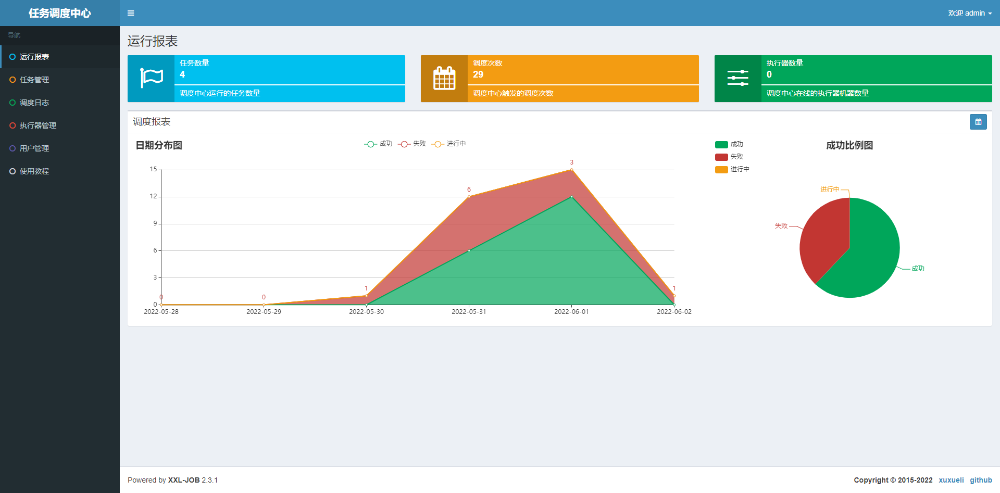
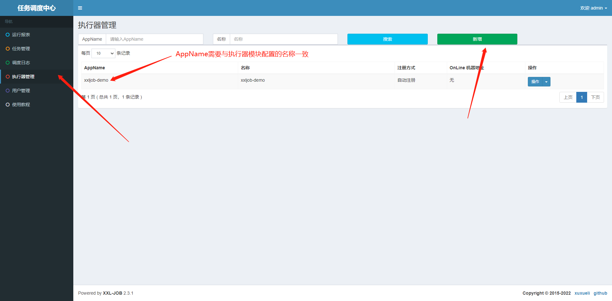
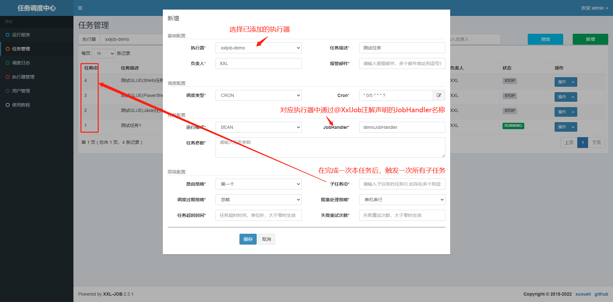

# 快速开始

## 初始化调度中心数据库

[官方初始化sql](https://github.com/xuxueli/xxl-job/blob/master/doc/db/tables_xxl_job.sql)

> 1. 可根据需要修改数据库名称，对应修改调度中心服务（`xxl-job-admin`）jdbc连接中的数据库名称
> 2. 初始化sql末尾含部分初始化数据，可按需选用
> 3. 其中初始化了默认用户名（admin）及密码（123456）

```sql
#
# XXL-JOB v2.4.0-SNAPSHOT
# Copyright (c) 2015-present, xuxueli.

CREATE database if NOT EXISTS `xxl_job` default character set utf8mb4 collate utf8mb4_unicode_ci;
use `xxl_job`;

SET NAMES utf8mb4;

CREATE TABLE `xxl_job_info` (
  `id` int(11) NOT NULL AUTO_INCREMENT,
  `job_group` int(11) NOT NULL COMMENT '执行器主键ID',
  `job_desc` varchar(255) NOT NULL,
  `add_time` datetime DEFAULT NULL,
  `update_time` datetime DEFAULT NULL,
  `author` varchar(64) DEFAULT NULL COMMENT '作者',
  `alarm_email` varchar(255) DEFAULT NULL COMMENT '报警邮件',
  `schedule_type` varchar(50) NOT NULL DEFAULT 'NONE' COMMENT '调度类型',
  `schedule_conf` varchar(128) DEFAULT NULL COMMENT '调度配置，值含义取决于调度类型',
  `misfire_strategy` varchar(50) NOT NULL DEFAULT 'DO_NOTHING' COMMENT '调度过期策略',
  `executor_route_strategy` varchar(50) DEFAULT NULL COMMENT '执行器路由策略',
  `executor_handler` varchar(255) DEFAULT NULL COMMENT '执行器任务handler',
  `executor_param` varchar(512) DEFAULT NULL COMMENT '执行器任务参数',
  `executor_block_strategy` varchar(50) DEFAULT NULL COMMENT '阻塞处理策略',
  `executor_timeout` int(11) NOT NULL DEFAULT '0' COMMENT '任务执行超时时间，单位秒',
  `executor_fail_retry_count` int(11) NOT NULL DEFAULT '0' COMMENT '失败重试次数',
  `glue_type` varchar(50) NOT NULL COMMENT 'GLUE类型',
  `glue_source` mediumtext COMMENT 'GLUE源代码',
  `glue_remark` varchar(128) DEFAULT NULL COMMENT 'GLUE备注',
  `glue_updatetime` datetime DEFAULT NULL COMMENT 'GLUE更新时间',
  `child_jobid` varchar(255) DEFAULT NULL COMMENT '子任务ID，多个逗号分隔',
  `trigger_status` tinyint(4) NOT NULL DEFAULT '0' COMMENT '调度状态：0-停止，1-运行',
  `trigger_last_time` bigint(13) NOT NULL DEFAULT '0' COMMENT '上次调度时间',
  `trigger_next_time` bigint(13) NOT NULL DEFAULT '0' COMMENT '下次调度时间',
  PRIMARY KEY (`id`)
) ENGINE=InnoDB DEFAULT CHARSET=utf8mb4;

CREATE TABLE `xxl_job_log` (
  `id` bigint(20) NOT NULL AUTO_INCREMENT,
  `job_group` int(11) NOT NULL COMMENT '执行器主键ID',
  `job_id` int(11) NOT NULL COMMENT '任务，主键ID',
  `executor_address` varchar(255) DEFAULT NULL COMMENT '执行器地址，本次执行的地址',
  `executor_handler` varchar(255) DEFAULT NULL COMMENT '执行器任务handler',
  `executor_param` varchar(512) DEFAULT NULL COMMENT '执行器任务参数',
  `executor_sharding_param` varchar(20) DEFAULT NULL COMMENT '执行器任务分片参数，格式如 1/2',
  `executor_fail_retry_count` int(11) NOT NULL DEFAULT '0' COMMENT '失败重试次数',
  `trigger_time` datetime DEFAULT NULL COMMENT '调度-时间',
  `trigger_code` int(11) NOT NULL COMMENT '调度-结果',
  `trigger_msg` text COMMENT '调度-日志',
  `handle_time` datetime DEFAULT NULL COMMENT '执行-时间',
  `handle_code` int(11) NOT NULL COMMENT '执行-状态',
  `handle_msg` text COMMENT '执行-日志',
  `alarm_status` tinyint(4) NOT NULL DEFAULT '0' COMMENT '告警状态：0-默认、1-无需告警、2-告警成功、3-告警失败',
  PRIMARY KEY (`id`),
  KEY `I_trigger_time` (`trigger_time`),
  KEY `I_handle_code` (`handle_code`)
) ENGINE=InnoDB DEFAULT CHARSET=utf8mb4;

CREATE TABLE `xxl_job_log_report` (
  `id` int(11) NOT NULL AUTO_INCREMENT,
  `trigger_day` datetime DEFAULT NULL COMMENT '调度-时间',
  `running_count` int(11) NOT NULL DEFAULT '0' COMMENT '运行中-日志数量',
  `suc_count` int(11) NOT NULL DEFAULT '0' COMMENT '执行成功-日志数量',
  `fail_count` int(11) NOT NULL DEFAULT '0' COMMENT '执行失败-日志数量',
  `update_time` datetime DEFAULT NULL,
  PRIMARY KEY (`id`),
  UNIQUE KEY `i_trigger_day` (`trigger_day`) USING BTREE
) ENGINE=InnoDB DEFAULT CHARSET=utf8mb4;

CREATE TABLE `xxl_job_logglue` (
  `id` int(11) NOT NULL AUTO_INCREMENT,
  `job_id` int(11) NOT NULL COMMENT '任务，主键ID',
  `glue_type` varchar(50) DEFAULT NULL COMMENT 'GLUE类型',
  `glue_source` mediumtext COMMENT 'GLUE源代码',
  `glue_remark` varchar(128) NOT NULL COMMENT 'GLUE备注',
  `add_time` datetime DEFAULT NULL,
  `update_time` datetime DEFAULT NULL,
  PRIMARY KEY (`id`)
) ENGINE=InnoDB DEFAULT CHARSET=utf8mb4;

CREATE TABLE `xxl_job_registry` (
  `id` int(11) NOT NULL AUTO_INCREMENT,
  `registry_group` varchar(50) NOT NULL,
  `registry_key` varchar(255) NOT NULL,
  `registry_value` varchar(255) NOT NULL,
  `update_time` datetime DEFAULT NULL,
  PRIMARY KEY (`id`),
  KEY `i_g_k_v` (`registry_group`,`registry_key`,`registry_value`)
) ENGINE=InnoDB DEFAULT CHARSET=utf8mb4;

CREATE TABLE `xxl_job_group` (
  `id` int(11) NOT NULL AUTO_INCREMENT,
  `app_name` varchar(64) NOT NULL COMMENT '执行器AppName',
  `title` varchar(12) NOT NULL COMMENT '执行器名称',
  `address_type` tinyint(4) NOT NULL DEFAULT '0' COMMENT '执行器地址类型：0=自动注册、1=手动录入',
  `address_list` text COMMENT '执行器地址列表，多地址逗号分隔',
  `update_time` datetime DEFAULT NULL,
  PRIMARY KEY (`id`)
) ENGINE=InnoDB DEFAULT CHARSET=utf8mb4;

CREATE TABLE `xxl_job_user` (
  `id` int(11) NOT NULL AUTO_INCREMENT,
  `username` varchar(50) NOT NULL COMMENT '账号',
  `password` varchar(50) NOT NULL COMMENT '密码',
  `role` tinyint(4) NOT NULL COMMENT '角色：0-普通用户、1-管理员',
  `permission` varchar(255) DEFAULT NULL COMMENT '权限：执行器ID列表，多个逗号分割',
  PRIMARY KEY (`id`),
  UNIQUE KEY `i_username` (`username`) USING BTREE
) ENGINE=InnoDB DEFAULT CHARSET=utf8mb4;

CREATE TABLE `xxl_job_lock` (
  `lock_name` varchar(50) NOT NULL COMMENT '锁名称',
  PRIMARY KEY (`lock_name`)
) ENGINE=InnoDB DEFAULT CHARSET=utf8mb4;

INSERT INTO `xxl_job_group`(`id`, `app_name`, `title`, `address_type`, `address_list`, `update_time`) VALUES (1, 'xxl-job-executor-sample', '示例执行器', 0, NULL, '2018-11-03 22:21:31' );
INSERT INTO `xxl_job_info`(`id`, `job_group`, `job_desc`, `add_time`, `update_time`, `author`, `alarm_email`, `schedule_type`, `schedule_conf`, `misfire_strategy`, `executor_route_strategy`, `executor_handler`, `executor_param`, `executor_block_strategy`, `executor_timeout`, `executor_fail_retry_count`, `glue_type`, `glue_source`, `glue_remark`, `glue_updatetime`, `child_jobid`) VALUES (1, 1, '测试任务1', '2018-11-03 22:21:31', '2018-11-03 22:21:31', 'XXL', '', 'CRON', '0 0 0 * * ? *', 'DO_NOTHING', 'FIRST', 'demoJobHandler', '', 'SERIAL_EXECUTION', 0, 0, 'BEAN', '', 'GLUE代码初始化', '2018-11-03 22:21:31', '');
INSERT INTO `xxl_job_user`(`id`, `username`, `password`, `role`, `permission`) VALUES (1, 'admin', 'e10adc3949ba59abbe56e057f20f883e', 1, NULL);
INSERT INTO `xxl_job_lock` ( `lock_name`) VALUES ( 'schedule_lock');

commit;
```

## 部署调度中心（xxl-job-admin）

**支持启动多个实例**，多实例集群情况下，官方建议使用Nginx实现负载均衡

### docker-compose.yml

```yaml
version: '3.8'
services:
  xxl-job-admin:
    image: xuxueli/xxl-job-admin:2.3.1
    container_name: xxl-job-admin
    restart: always
    network_mode: host
    environment:
      TZ: "Asia/Shanghai"
      PARAMS: "--server.port=9000 \
               --spring.datasource.url=jdbc:mysql://192.168.10.215:3306/xxl_job?useUnicode=true&characterEncoding=UTF-8&autoReconnect=true&serverTimezone=Asia/Shanghai \
               --spring.datasource.username=root \
               --spring.datasource.password=yg123456 \
               --xxl.job.accessToken=default_token"
```

### 调度中心管理界面

> 访问地址：http://192.168.10.244:9000/xxl-job-admin/



## 编写执行器

> 基于SpringBoot项目

### maven依赖

```xml

<dependency>
    <groupId>com.xuxueli</groupId>
    <artifactId>xxl-job-core</artifactId>
    <version>2.3.1</version>
</dependency>
```

### 配置类

```java
package net.cdsunrise.demo.xxljobdemo.config;

import com.xxl.job.core.executor.impl.XxlJobSpringExecutor;
import org.springframework.boot.context.properties.ConfigurationProperties;
import org.springframework.context.annotation.Bean;
import org.springframework.context.annotation.Configuration;

/**
 * @author lijiafeng 2022/05/31 16:05
 */
@Configuration
@ConfigurationProperties("xxl-job.executor")
public class XxlJobConfig {

    private String appName;
    private String adminAddresses;
    private String ip;
    private int port;
    private String accessToken;

    @Bean
    public XxlJobSpringExecutor xxlJobSpringExecutor() {
        XxlJobSpringExecutor xxlJobSpringExecutor = new XxlJobSpringExecutor();
        xxlJobSpringExecutor.setAppname(appName);
        xxlJobSpringExecutor.setAdminAddresses(adminAddresses);
        xxlJobSpringExecutor.setIp(ip);
        xxlJobSpringExecutor.setPort(port);
        xxlJobSpringExecutor.setAccessToken(accessToken);
        return xxlJobSpringExecutor;
    }

    public String getAppName() {
        return appName;
    }

    public void setAppName(String appName) {
        this.appName = appName;
    }

    public String getAdminAddresses() {
        return adminAddresses;
    }

    public void setAdminAddresses(String adminAddresses) {
        this.adminAddresses = adminAddresses;
    }

    public String getIp() {
        return ip;
    }

    public void setIp(String ip) {
        this.ip = ip;
    }

    public int getPort() {
        return port;
    }

    public void setPort(int port) {
        this.port = port;
    }

    public String getAccessToken() {
        return accessToken;
    }

    public void setAccessToken(String accessToken) {
        this.accessToken = accessToken;
    }
}

```

### 配置参数

```yaml
xxl-job:
  executor:
    # 执行器名称
    app-name: ${spring.application.name}
    # 调度中心地址
    admin-addresses: http://192.168.10.244:9000/xxl-job-admin
    # 执行器IP，可以不填，但是多网卡环境可能导致IP识别错误
    ip: 192.168.9.58
    # 执行器端口
    port: 9999
    # 调度中心的访问密钥，需要与调度中心的配置xxl.job.accessToken一致
    access-token: default_token
```

### 执行器类

> 官网目前推荐使用`@XxlJob`注解实现方法级别的JobHandler注册  
> 可通过`XxlJobHelper`类可以获取任务的上下文内容，以及打印任务日志

```java
package net.cdsunrise.demo.xxljobdemo.xxljob;

import com.xxl.job.core.biz.model.ReturnT;
import com.xxl.job.core.context.XxlJobHelper;
import com.xxl.job.core.handler.annotation.XxlJob;
import org.slf4j.Logger;
import org.slf4j.LoggerFactory;
import org.springframework.stereotype.Component;

/**
 * @author lijiafeng 2022/05/31 17:13
 */
@Component
public class DemoJobHandler {

    private static final Logger LOGGER = LoggerFactory.getLogger(DemoJobHandler.class);

    @XxlJob("demoJobHandler")
    public ReturnT<String> execute() {
        String jobParam = XxlJobHelper.getJobParam();
        int shardIndex = XxlJobHelper.getShardIndex();
        int shardTotal = XxlJobHelper.getShardTotal();
        XxlJobHelper.log(">>>>>>>>>>> demoJobHandler execute jobParam: [{}], shardIndex: [{}], shardTotal: [{}]", jobParam, shardIndex, shardTotal);
        return new ReturnT<>(">>>>>>>>>>> demoJobHandler execute success!");
    }
}

```

## 在调度中心添加执行器及任务

> 更多详细配置可参见[官方文档](https://www.xuxueli.com/xxl-job/)





<Vssue :title="XXL-JOB快速开始"></Vssue>